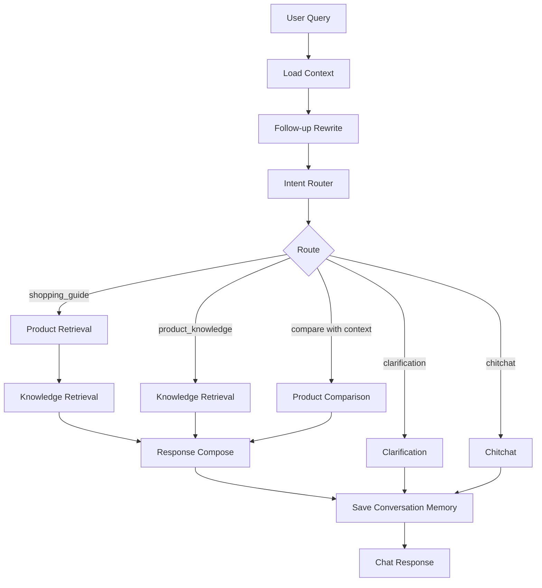
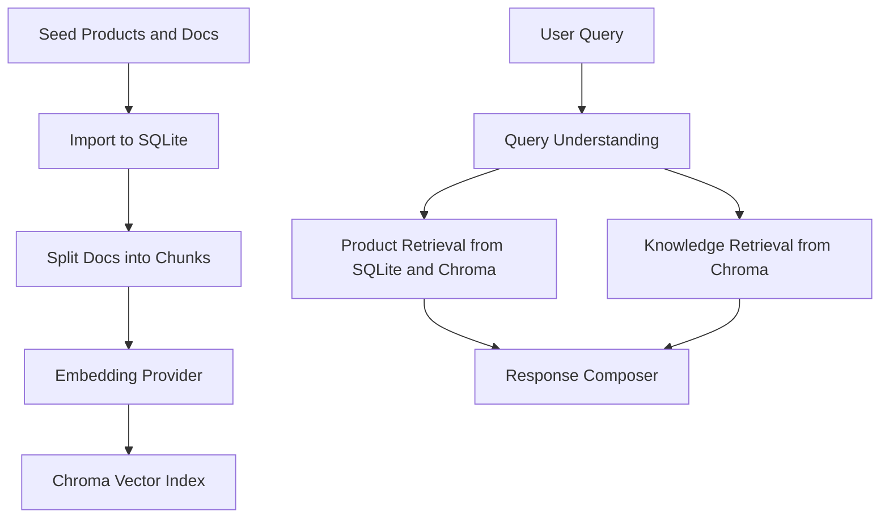

# SmartBuyAgent

Language / 语言: [中文](#中文) | [English](#english)

<a id="中文"></a>

<details open>
<summary><strong>中文 README</strong></summary>

## 1. 项目简介

SmartBuyAgent 是一个面向新零售全新商品导购场景的 RAG + Agent 应用原型。系统基于结构化商品数据、Markdown 知识文档、Chroma 向量检索、LangGraph AgentWorkflow、多轮会话记忆、SSE Debug 流和反馈收集，为用户提供商品推荐、知识解释、预算追问、候选商品比较和可视化调试能力。

当前 MVP 支持三个品类：

- 手机
- 鞋靴
- 护肤

SmartBuyAgent 是智能导购、推荐解释和商品知识问答系统，不是完整电商交易系统。

用户可以询问：

- `预算3000，推荐一款拍照好的手机`
- `预算提高到4000呢`
- `第一个和第二个有什么区别`
- `为什么手机拍照不能只看像素`
- `敏感肌用什么保湿修护面霜，预算300以内`

当前 `/api/chat` 运行时主链路已经切换为基于 LangGraph 的 `AgentWorkflow`。商品卡片来自商品召回或候选商品内比较，引用来自知识检索，LLM 只负责 `answer` 的自然语言表达。

## 2. 核心能力

- 多品类导购：手机、鞋靴、护肤。
- 结构化商品召回：支持品类、预算、库存、动态属性和标签上下文。
- RAG 知识解释：从 Markdown 知识库 chunk 中检索依据并返回 citations。
- 规则版 QueryUnderstanding：解析意图、品类、预算和偏好。
- 会话记忆：支持 `session_id` 和对话轮次持久化。
- 规则版追问改写：支持预算变化、模糊指代和序号引用。
- 候选商品内比较：只比较上一轮候选商品，不全库乱比。
- LangGraph AgentWorkflow：编排上下文读取、追问改写、意图路由、商品召回、知识检索、候选比较和回答生成。
- SSE 调试流：输出 `session`、`trace`、`result`、`done`、`error` 事件。
- 前端 Chat Workspace：左侧内存会话栏、中间聊天流、底部输入框、每条回答独立展开 Debug。
- Feedback Loop：支持 `helpful` / `not_helpful` 反馈收集。

## 3. 技术架构

后端：

- FastAPI
- SQLAlchemy
- SQLite
- Chroma
- LangGraph
- Mock embedding / OpenAI-compatible embedding provider
- Mock LLM / OpenAI-compatible LLM provider
- Pytest

前端：

- React
- TypeScript
- Vite
- Fetch + ReadableStream SSE
- Chat-style workspace
- In-memory session sidebar
- Agent Timeline
- Feedback Panel

数据：

- `categories`, `category_attribute_defs`, `category_profiles`
- `products`, `product_attributes`, `product_tags`
- `documents`, `document_chunks`
- `chat_sessions`, `chat_turns`
- `chat_feedback`

详细架构见 [docs/ARCHITECTURE.md](docs/ARCHITECTURE.md)。

## 4. AgentWorkflow 执行流程



关键边界：

- LLM 只生成 `answer` 文本。
- `product_cards` 来自商品召回或候选商品内比较。
- `citations` 来自知识检索。
- follow-up rewrite 只更新实际处理用的 effective query，不覆盖用户原始 query。
- conversation memory 保存用户原始输入。

## 5. RAG 数据流



- SQLite 保存结构化商品、动态属性、标签、文档元数据、chunks、会话、对话轮次和反馈。
- Chroma 保存 `product_text` 和 `knowledge_docs` 两个向量索引。
- citations 必须来自知识检索，不由 LLM 编造。
- 切换 embedding provider 或 model 后必须重建 Chroma 索引。

## 6. 前端页面

当前前端是接近 ChatGPT 的 Chat Workspace：

- 左侧内存版会话历史，不依赖后端 session list API。
- 中间是当前会话的聊天消息流。
- 底部固定输入框，支持 Enter 发送、Shift + Enter 换行。
- 空会话展示欢迎页和示例问题，示例问题只填入输入框，不自动发送。
- 支持普通 `Send` 和 SSE `Stream` 两种请求方式。
- 每条 assistant 回复独立展示 answer、product cards、citations 和 feedback。
- 每条 assistant 回复都有“查看 Debug”按钮，可展开该条回复自己的 Agent Timeline、Raw Trace JSON 和 Raw Response JSON。
- 切换前端会话不会混用 backend `session_id`。

## 7. API

### `GET /health`

返回服务健康状态。

```json
{
  "status": "ok",
  "app": "SmartBuyAgent",
  "version": "0.1.0"
}
```

### `POST /api/chat`

普通非流式聊天接口。

请求：

```json
{
  "query": "预算3000，推荐一款拍照好的手机",
  "session_id": null,
  "debug": true
}
```

响应包含：

- `answer`
- `product_cards`
- `citations`
- `trace`
- `session_id`

### `POST /api/chat/stream`

SSE 调试接口，响应类型为 `text/event-stream`。

事件：

- `session`：生成或复用的 `session_id`
- `trace`：AgentWorkflow trace step
- `result`：最终聊天结果
- `done`：流结束
- `error`：流级别错误

当前实现是先执行完整 AgentWorkflow，再按顺序输出 trace 事件；尚未实现 token 级 LLM streaming。

### `POST /api/feedback`

保存用户对回答的反馈。

请求：

```json
{
  "session_id": "session-id",
  "turn_id": null,
  "rating": "helpful",
  "reason": "recommendation_relevant",
  "comment": "The comparison was clear.",
  "query": "预算3000，推荐一款拍照好的手机",
  "answer_preview": "..."
}
```

响应：

```json
{
  "id": 1,
  "status": "saved"
}
```

更详细的 API 文档见 [docs/API.md](docs/API.md)。

## 8. 快速启动

后端：

```bash
cd backend
pip install -r requirements.txt
uvicorn app.main:app --reload
```

前端：

```bash
cd frontend
npm install
npm run dev
```

环境配置：

- `.env.example` 提供非敏感默认配置。
- 默认 embedding provider 是 `mock`。
- 默认 LLM provider 是 `mock`。
- 不要提交真实 API key。

## 9. 数据初始化与索引构建

从 `backend` 目录执行：

```bash
cd backend
python ../scripts/init_db.py
python ../scripts/import_categories.py
python ../scripts/import_products.py --dataset mini
python ../scripts/import_docs.py
python ../scripts/rebuild_index.py
```

检索评测：

```bash
cd backend
python ../scripts/eval_retrieval.py
python ../scripts/eval_multiturn.py
```

## 10. 测试与验证

后端：

```bash
cd backend
pytest
```

前端：

```bash
cd frontend
npm run build
```

当前测试覆盖：

- Chat API
- Chat SSE API
- AgentWorkflow
- Product retrieval
- Knowledge retrieval
- Follow-up rewrite
- In-session comparison
- LLM answer guardrails
- Conversation memory
- Feedback API
- Frontend TypeScript build

评估说明见 [docs/EVALUATION.md](docs/EVALUATION.md)。

## 11. 项目边界

SmartBuyAgent 不是完整电商交易系统，不包含：

- 登录或用户账号系统
- 购物车
- 下单
- 支付
- 订单履约
- 售后工单
- 购买按钮

系统只提供导购建议、商品知识解释、候选商品比较、调试可视化和反馈收集，不执行真实购买行为。

护肤相关回答只提供日常护理建议、成分解释和选购注意事项，不提供医疗诊断，不承诺治疗、治愈或药效。

## 12. Roadmap

后续可继续扩展：

- 接入更丰富的真实商品数据源。
- 构建更完整的自动化评测集。
- 基于 feedback 做检索和推荐质量分析 dashboard。
- 实现真正节点级实时 streaming。
- 引入更复杂的长期个性化记忆。
- 增加部署、监控和日志分析。
- 扩展敏感或强监管品类的安全评测。

## 13. 更多文档

- [Architecture](docs/ARCHITECTURE.md)
- [API](docs/API.md)
- [Evaluation](docs/EVALUATION.md)
- [Demo Script](docs/DEMO_SCRIPT.md)

</details>

<a id="english"></a>

<details>
<summary><strong>English README</strong></summary>

## 1. Project Overview

SmartBuyAgent is a RAG + Agent shopping-guide prototype for new retail products. It combines structured product data, Markdown knowledge documents, Chroma vector search, LangGraph AgentWorkflow orchestration, conversation memory, SSE debug streaming, and feedback collection.

The current MVP supports three categories:

- Phones
- Shoes
- Skincare

SmartBuyAgent is a guide and explanation system. It recommends and compares candidate products, explains product knowledge with citations, and collects feedback. It is not a full ecommerce transaction system.

Example questions:

- `预算3000，推荐一款拍照好的手机`
- `预算提高到4000呢`
- `第一个和第二个有什么区别`
- `为什么手机拍照不能只看像素`
- `敏感肌用什么保湿修护面霜，预算300以内`

The runtime `/api/chat` path is routed through a LangGraph-based `AgentWorkflow`. Product cards are produced from retrieval or in-session comparison, citations are produced from knowledge retrieval, and the LLM is constrained to answer wording only.

## 2. Core Capabilities

- Multi-category shopping guide for phones, shoes, and skincare.
- Structured product retrieval with category, budget, stock, dynamic attribute, and tag context.
- RAG knowledge explanation with citations from imported Markdown knowledge chunks.
- Rule-based query understanding for intent, category, budget, and preferences.
- Conversation memory with `session_id` and persisted chat turns.
- Rule-based follow-up rewrite for budget changes, vague references, and ordinal references.
- In-session product comparison restricted to previous candidate product IDs.
- LangGraph AgentWorkflow orchestration for context loading, rewrite, routing, retrieval, comparison, and response composition.
- SSE debug stream for session, trace, result, done, and error events.
- Frontend Chat Workspace with an in-memory session sidebar, chat message stream, bottom input bar, and per-answer expandable Debug panels.
- Feedback loop with `helpful` / `not_helpful` ratings for future evaluation.

## 3. Technical Architecture

Backend:

- FastAPI
- SQLAlchemy
- SQLite
- Chroma
- LangGraph
- Mock embedding and OpenAI-compatible embedding provider
- Mock LLM and OpenAI-compatible LLM provider
- Pytest

Frontend:

- React
- TypeScript
- Vite
- Fetch plus ReadableStream SSE handling
- Chat-style workspace
- In-memory session sidebar
- Agent Timeline
- Feedback Panel

Data:

- `categories`, `category_attribute_defs`, `category_profiles`
- `products`, `product_attributes`, `product_tags`
- `documents`, `document_chunks`
- `chat_sessions`, `chat_turns`
- `chat_feedback`

More detail is available in [docs/ARCHITECTURE.md](docs/ARCHITECTURE.md).

## 4. AgentWorkflow Execution Flow


Important boundaries:

- The LLM only writes the `answer` text.
- `product_cards` come from product retrieval or in-session product comparison.
- `citations` come from knowledge retrieval.
- Follow-up rewrite updates the effective query for processing, but conversation memory still stores the original user query.
- Conversation memory is saved by the API layer after the AgentWorkflow returns.

## 5. RAG Data Flow


- SQLite stores structured product data, dynamic attributes, tags, document metadata, chunks, sessions, turns, and feedback.
- Chroma stores vector indexes for `product_text` and `knowledge_docs`.
- Citations must come from retrieved knowledge chunks; they are not invented by the LLM.
- Switching embedding provider or model requires rebuilding the Chroma index.

## 6. Frontend Pages

The current frontend is a ChatGPT-style Chat Workspace:

- In-memory session sidebar; no backend session list API is required.
- Chat message stream for the active session.
- Sticky bottom input bar with Enter to send and Shift + Enter for a new line.
- Empty conversations show a welcome panel with showcase prompts; clicking a prompt only fills the input.
- Both normal `Send` and SSE `Stream` requests are supported.
- Each assistant reply independently renders its answer, product cards, citations, and feedback.
- Each assistant reply has a `查看 Debug` toggle that expands that reply's own Agent Timeline, Raw Trace JSON, and Raw Response JSON.
- Switching frontend sessions keeps backend `session_id` values isolated per local session.

## 7. API

### `GET /health`

Returns service health.

```json
{
  "status": "ok",
  "app": "SmartBuyAgent",
  "version": "0.1.0"
}
```

### `POST /api/chat`

Normal non-streaming chat endpoint.

Request:

```json
{
  "query": "预算3000，推荐一款拍照好的手机",
  "session_id": null,
  "debug": true
}
```

Response contains:

- `answer`
- `product_cards`
- `citations`
- `trace`
- `session_id`

### `POST /api/chat/stream`

SSE debug endpoint. Response content type: `text/event-stream`.

Events:

- `session`: generated or reused `session_id`
- `trace`: AgentWorkflow trace step
- `result`: final chat response
- `done`: stream completion
- `error`: stream-level failure

The current implementation runs the AgentWorkflow first, then emits trace events in order. Token-level LLM streaming is not implemented.

### `POST /api/feedback`

Stores user feedback for an answer.

Request:

```json
{
  "session_id": "session-id",
  "turn_id": null,
  "rating": "helpful",
  "reason": "recommendation_relevant",
  "comment": "The comparison was clear.",
  "query": "预算3000，推荐一款拍照好的手机",
  "answer_preview": "..."
}
```

Response:

```json
{
  "id": 1,
  "status": "saved"
}
```

Detailed API notes are in [docs/API.md](docs/API.md).

## 8. Quick Start

Backend:

```bash
cd backend
pip install -r requirements.txt
uvicorn app.main:app --reload
```

Frontend:

```bash
cd frontend
npm install
npm run dev
```

Environment configuration:

- `.env.example` contains non-secret defaults.
- Default embedding provider is `mock`.
- Default LLM provider is `mock`.
- Do not commit real API keys.

## 9. Data Initialization and Index Build

Run these commands from the `backend` directory:

```bash
cd backend
python ../scripts/init_db.py
python ../scripts/import_categories.py
python ../scripts/import_products.py --dataset mini
python ../scripts/import_docs.py
python ../scripts/rebuild_index.py
```

Retrieval evaluation:

```bash
cd backend
python ../scripts/eval_retrieval.py
python ../scripts/eval_multiturn.py
```

## 10. Tests and Verification

Backend:

```bash
cd backend
pytest
```

Frontend:

```bash
cd frontend
npm run build
```

Current evaluation coverage includes:

- Chat API
- Chat SSE API
- AgentWorkflow
- Product retrieval
- Knowledge retrieval
- Follow-up rewrite
- In-session comparison
- LLM answer guardrails
- Conversation memory
- Feedback API
- Frontend TypeScript build

See [docs/EVALUATION.md](docs/EVALUATION.md).

## 11. Project Boundaries

SmartBuyAgent is not a complete ecommerce transaction system. It does not include:

- Login or user account system
- Shopping cart
- Order creation
- Payment
- Transaction fulfillment
- After-sales ticket handling
- Purchase buttons

The system only provides shopping guidance, product knowledge explanation, candidate comparison, debug visualization, and feedback collection. It does not execute real purchase behavior.

Skincare answers are limited to daily care suggestions, ingredient explanations, and shopping considerations. The system does not provide medical diagnosis, treatment, cure claims, or drug-effect claims.

## 12. Roadmap

The following items remain future work:

- Connect richer real product data sources.
- Build a broader automated evaluation suite.
- Analyze feedback for retrieval and recommendation quality dashboards.
- Implement true node-level real-time streaming.
- Add more advanced long-term personalization memory.
- Add deployment, monitoring, and log analysis.
- Expand safety evaluation for regulated or sensitive product categories.

## 13. Additional Documentation

- [Architecture](docs/ARCHITECTURE.md)
- [API](docs/API.md)
- [Evaluation](docs/EVALUATION.md)
- [Demo Script](docs/DEMO_SCRIPT.md)

</details>
