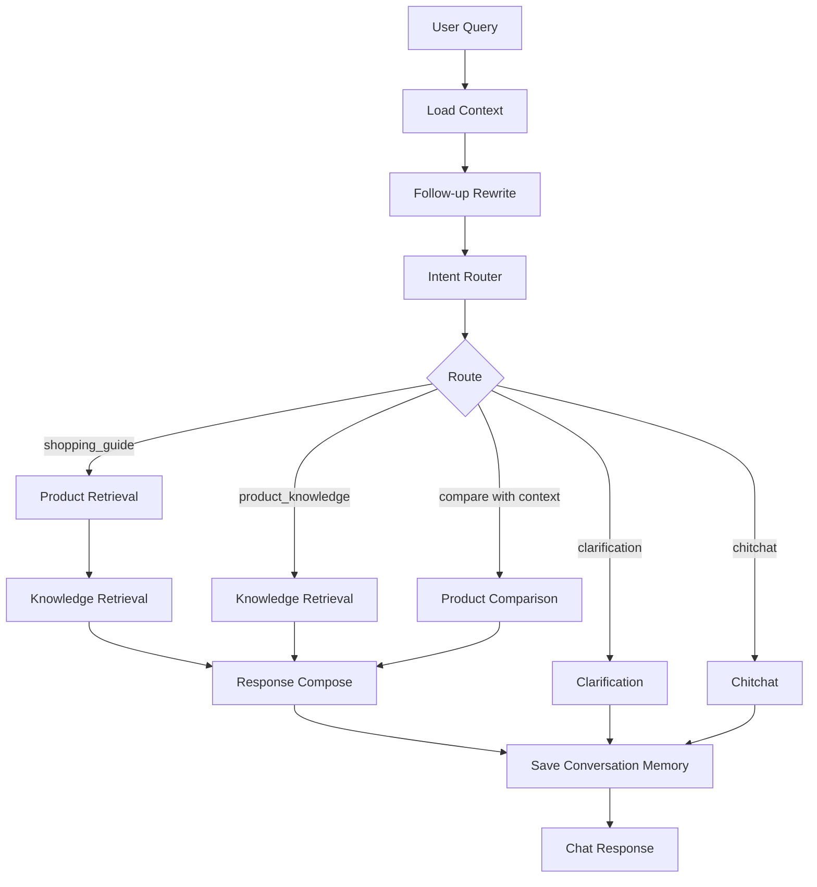
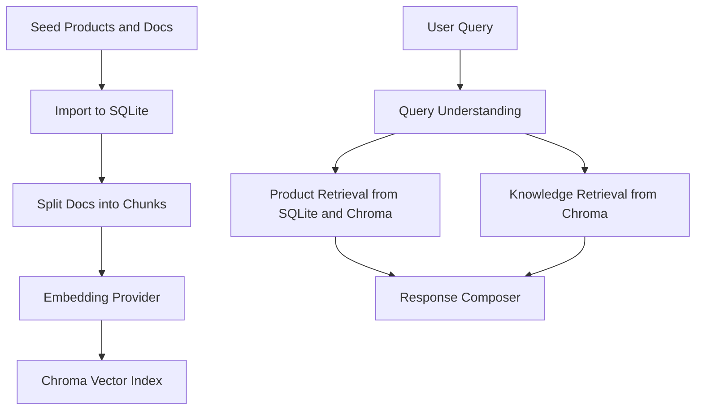

# SmartBuyAgent

SmartBuyAgent is a RAG + Agent shopping-guide prototype for new retail products. It combines structured product data, Markdown knowledge documents, Chroma vector search, LangGraph AgentWorkflow orchestration, conversation memory, SSE debug streaming, and feedback collection.

The current MVP supports three categories:

- Phones
- Shoes
- Skincare

SmartBuyAgent is a guide and explanation system. It recommends and compares candidate products, explains product knowledge with citations, and collects feedback. It is not a full ecommerce transaction system.

## 1. Project Overview

SmartBuyAgent helps users ask shopping questions such as:

- `预算3000，推荐一款拍照好的手机`
- `预算提高到4000呢`
- `第一个和第二个有什么区别`
- `为什么手机拍照不能只看像素`
- `敏感肌用什么保湿修护面霜，预算300以内`

The runtime `/api/chat` path is now routed through a LangGraph-based `AgentWorkflow`. Product cards are produced from retrieval or in-session comparison, citations are produced from knowledge retrieval, and the LLM is constrained to answer wording only.

## 2. Core Capabilities

- Multi-category shopping guide for phones, shoes, and skincare.
- Structured product retrieval with category, budget, stock, dynamic attribute, and tag context.
- RAG knowledge explanation with citations from imported Markdown knowledge chunks.
- Rule-based query understanding for intent, category, budget, and preferences.
- Conversation memory with `session_id` and persisted chat turns.
- Rule-based follow-up rewrite for budget changes, vague references, and ordinal references.
- In-session product comparison restricted to previous candidate product IDs.
- LangGraph AgentWorkflow orchestration for context loading, rewrite, routing, retrieval, comparison, and response composition.
- SSE Web Debug stream for session, trace, result, done, and error events.
- Frontend Web Showcase, Web Debug workspace, Agent Timeline, raw JSON debug view, and Feedback Panel.
- Feedback loop with `helpful` / `not_helpful` ratings for future evaluation.

## 3. Technical Architecture

Backend:

- FastAPI
- SQLAlchemy
- SQLite
- Chroma
- LangGraph
- Mock embedding and OpenAI-compatible embedding provider
- Mock LLM and OpenAI-compatible LLM provider
- Pytest

Frontend:

- React
- TypeScript
- Vite
- Fetch plus ReadableStream SSE handling
- Web Showcase page
- Web Debug workspace
- Agent Timeline
- Feedback Panel

Data:

- `categories`, `category_attribute_defs`, `category_profiles`
- `products`, `product_attributes`, `product_tags`
- `documents`, `document_chunks`
- `chat_sessions`, `chat_turns`
- `chat_feedback`

More detail is available in [docs/ARCHITECTURE.md](docs/ARCHITECTURE.md).

## 4. AgentWorkflow Execution Flow



Important boundaries:

- The LLM only writes the `answer` text.
- `product_cards` come from product retrieval or in-session product comparison.
- `citations` come from knowledge retrieval.
- Follow-up rewrite updates the effective query for processing, but conversation memory still stores the original user query.
- Conversation memory is saved by the API layer after the AgentWorkflow returns.

## 5. RAG Data Flow



- SQLite stores structured product data, dynamic attributes, tags, document metadata, chunks, sessions, turns, and feedback.
- Chroma stores vector indexes for `product_text` and `knowledge_docs`.
- Citations must come from retrieved knowledge chunks; they are not invented by the LLM.
- Switching embedding provider or model requires rebuilding the Chroma index.

## 6. Frontend Pages

Web Showcase:

- Project positioning
- Phone, shoes, and skincare scenario cards
- Example prompts
- Core capability cards
- Entry point into Web Debug

Web Debug:

- Normal `Send request`
- `Stream send` through SSE
- Session ID display and new-session reset
- Conversation history
- Product cards
- Citations
- Agent Timeline
- Raw trace JSON
- Raw response JSON
- Feedback Panel

## 7. API

### `GET /health`

Returns service health.

```json
{
  "status": "ok",
  "app": "SmartBuyAgent",
  "version": "0.1.0"
}
```

### `POST /api/chat`

Normal non-streaming chat endpoint.

Request:

```json
{
  "query": "预算3000，推荐一款拍照好的手机",
  "session_id": null,
  "debug": true
}
```

Response contains:

- `answer`
- `product_cards`
- `citations`
- `trace`
- `session_id`

### `POST /api/chat/stream`

SSE debug endpoint. Response content type: `text/event-stream`.

Events:

- `session`: generated or reused `session_id`
- `trace`: AgentWorkflow trace step
- `result`: final chat response
- `done`: stream completion
- `error`: stream-level failure

The current implementation runs the AgentWorkflow first, then emits trace events in order. Token-level LLM streaming is not implemented.

### `POST /api/feedback`

Stores user feedback for an answer.

Request:

```json
{
  "session_id": "session-id",
  "turn_id": null,
  "rating": "helpful",
  "reason": "recommendation_relevant",
  "comment": "The comparison was clear.",
  "query": "预算3000，推荐一款拍照好的手机",
  "answer_preview": "..."
}
```

Response:

```json
{
  "id": 1,
  "status": "saved"
}
```

Detailed API notes are in [docs/API.md](docs/API.md).

## 8. Quick Start

Backend:

```bash
cd backend
pip install -r requirements.txt
uvicorn app.main:app --reload
```

Frontend:

```bash
cd frontend
npm install
npm run dev
```

Environment configuration:

- `.env.example` contains non-secret defaults.
- Default embedding provider is `mock`.
- Default LLM provider is `mock`.
- Do not commit real API keys.

## 9. Data Initialization and Index Build

Run these commands from the `backend` directory:

```bash
cd backend
python ../scripts/init_db.py
python ../scripts/import_categories.py
python ../scripts/import_products.py --dataset mini
python ../scripts/import_docs.py
python ../scripts/rebuild_index.py
```

Retrieval evaluation:

```bash
cd backend
python ../scripts/eval_retrieval.py
python ../scripts/eval_multiturn.py
```

## 10. Tests and Verification

Backend:

```bash
cd backend
pytest
```

Frontend:

```bash
cd frontend
npm run build
```

Current evaluation coverage includes:

- Chat API
- Chat SSE API
- AgentWorkflow
- Product retrieval
- Knowledge retrieval
- Follow-up rewrite
- In-session comparison
- LLM answer guardrails
- Conversation memory
- Feedback API
- Frontend TypeScript build

See [docs/EVALUATION.md](docs/EVALUATION.md).

## 11. Project Boundaries

SmartBuyAgent is not a complete ecommerce transaction system. It does not include:

- Login or user account system
- Shopping cart
- Order creation
- Payment
- Transaction fulfillment
- After-sales ticket handling
- Purchase buttons

The system only provides shopping guidance, product knowledge explanation, candidate comparison, debug visualization, and feedback collection. It does not execute real purchase behavior.

Skincare answers are limited to daily care suggestions, ingredient explanations, and shopping considerations. The system does not provide medical diagnosis, treatment, cure claims, or drug-effect claims.

## 12. Roadmap

The following items remain future work:

- Connect richer real product data sources.
- Build a broader automated evaluation suite.
- Analyze feedback for retrieval and recommendation quality dashboards.
- Implement true node-level real-time streaming.
- Add more advanced long-term personalization memory.
- Add deployment, monitoring, and log analysis.
- Expand safety evaluation for regulated or sensitive product categories.

## Additional Documentation

- [Architecture](docs/ARCHITECTURE.md)
- [API](docs/API.md)
- [Evaluation](docs/EVALUATION.md)
- [Demo Script](docs/DEMO_SCRIPT.md)
